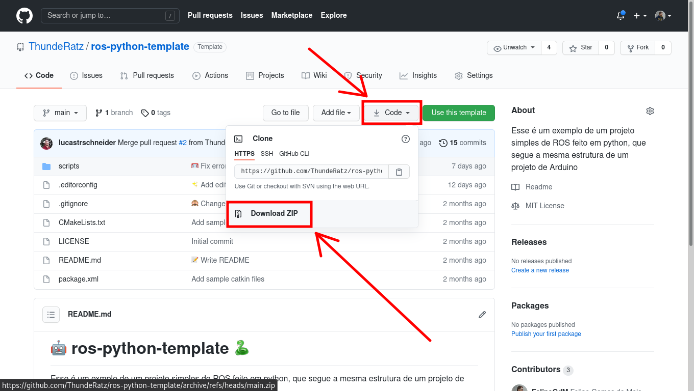

# 🤖 ros-python-template 🐍

Esse é um exemplo de um projeto simples de ROS feito em python, que segue a mesma estrutura de um projeto de Arduino

## Índice<!-- omit in toc -->

- [🎈 Introdução](#-introdução)
- [📂 Arquivos no projeto](#-arquivos-no-projeto)
- [🔨 Como executar](#-como-executar)
- [📚 Como utilizar as bibliotecas](#-como-utilizar-as-bibliotecas)
  - [🔦 Sensores de distância](#-sensores-de-distância)
  - [➖ Sensores de linha](#-sensores-de-linha)
  - [🏎️ Motores](#️-motores)

## 🎈 Introdução

A partir desse respositório que você construirá o código de controle do seu primeiro robô seguidor de linha simulado! Lembre-se de baixar (ou clonar) no mesmo workspace catkin que você criou enquanto seguia o tutorial de [como executar o projeto](https://thunderatz.github.io/ROSGazeboGuide/HowToRun/README.html).



## 📂 Arquivos no projeto

- **scripts/**
  - **control.py** - Arquivo onde a lógica de controle do robô será implementada
  - **run.py** - Arquivo a ser executado para controlar o robô
  - **utils/** - Pasta com bibliotecas para auxiliar no desenvolvimento do projeto
- **CMakeLists.txt** e **package.xml** - Arquivos de configuração do pacote ROS

## 🔨 Como executar

Antes de executar o código de controle, é preciso que a [simulação do Gazebo](https://github.com/ThundeRatz/gazebo_modelo_carrinho) esteja rodando. Depois disso, basta executar o comando

```bash
rosrun meu_primeiro_robo run.py
```

## 📚 Como utilizar as bibliotecas

Dentro da pasta **scripts/utils/**, existem alguns módulos de python para facilitar o desenvolvimento do código de controle do carrinho. A seguir, você encontrará uma breve descrição de como usar cada um deles.

### 🔦 Sensores de distância

Para utilizar a biblioteca dos sensores de distância, primeiro faça o import da classe `DistanceSensor`, disponível no módulo `utils.distance_sensor`.

```python
from utils.distance_sensor import DistanceSensor
```

Em seguida, crie uma variável do tipo `DistanceSensor`, especificando o tópico do sensor.

```python
my_distance_sensor = DistanceSensor('topico/do/sensor/de/distancia')
```

Na função de setup, é preciso inicializar nosso sensor de distância, para isso, chame o método `initialise()`.

```python
def setup():
  # ...
  my_distance_sensor.initialise()
```

Para ler o último valor de distância obtido pelo sensor, utilize o método `get_range()`.

```python
def loop():
  # ...
  range_reading = my_distance_sensor.get_range()
```

Juntando tudo, o código de leitura do sensor de distância deve ficar parecido com esse:

```python
from utils.distance_sensor import DistanceSensor

my_distance_sensor = DistanceSensor('topico/do/sensor/de/distancia')

def setup():
  # ...
  my_distance_sensor.initialise()

def loop():
  # ...
  range_reading = my_distance_sensor.get_range()
```

### ➖ Sensores de linha

### 🏎️ Motores

```python
from utils.motors import Motors
```

Para utilizar a biblioteca de controle dos motores, é necessário declarar uma variável do tipo `Motors`. Para fazer isso, é necessário especificar as interfaces de controle com cada motor

```python
motors = Motors('/topico/do/motor/esquerdo', '/topico/do/motor/direito')
```

Antes de utilizar da interface de controle, é necessário inicializar a variável por meio da função `initialise()`. É recomendável que isso seja feito dentro da função `setup()`

```python
def setup():
  # ...
  motors.initialise()
```

Por fim, os comandos para os motores podem ser enviados por meio da função `drive()`, que recebe como parâmetro dois números inteiros de **-255** (força total para trás) até **255** (força total para frente).

```python
def loop():
  # ...
  motors.drive(80, 80)
```

Juntando tudo, o código de controle deve conter os trechos

```python
from utils.motors import Motors

# ...

motors = Motors('/topico/do/motor/esquerdo', '/topico/do/motor/direito')

# ...

def setup():
  # ...
  motors.initialise()

def loop():
  # ...
  motors.drive(80, 80)
```
